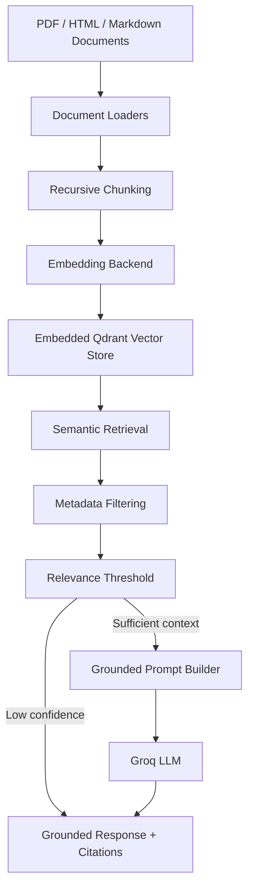

# Cost-Efficient RAG System

<p align="center">


</p>

<p align="center">
A modular Retrieval-Augmented Generation (RAG) framework built around reproducible evaluation, efficient document indexing, grounded question answering, and low-cost vector search.
</p>

---

## Overview

This project implements a complete Retrieval-Augmented Generation (RAG) pipeline capable of ingesting heterogeneous document collections, indexing them inside an embedded vector database, retrieving relevant context using semantic search, and generating grounded responses with citations.

Rather than focusing solely on answer generation, the project emphasizes the engineering aspects of building a production-style retrieval system. Every major component—including ingestion, indexing, retrieval, generation, evaluation, logging, and cost analysis—is modular, configurable, and independently testable.

Unlike many demonstration RAG applications that rebuild the index on every execution, this implementation performs **deterministic idempotent ingestion**, allowing unchanged documents to be skipped while only modified content is re-embedded. This significantly reduces unnecessary computation and enables efficient incremental updates.

The project also includes a complete evaluation framework measuring retrieval quality, answer quality, latency, and infrastructure cost, making it suitable not only as a question-answering system but also as a reproducible experimental platform for Retrieval-Augmented Generation research.

---

# Key Features

### Document Processing

- Supports **PDF**, **HTML**, and **Markdown** documents
- Header-aware recursive chunking
- Configurable chunk size and overlap
- Deterministic chunk identifiers
- Incremental document updates
- Automatic removal of stale vectors

---

### Retrieval Engine

- Embedded **Qdrant** vector database
- Configurable Top-K retrieval
- Metadata-aware search
- Multiple embedding backends
    - Sentence Transformers
    - spaCy
    - Deterministic Hashing (testing)
- Configurable retrieval threshold

---

### Grounded Generation

- Groq-powered LLM generation
- Context-aware prompting
- Source citations
- Confidence gate preventing unsupported answers
- Stub mode for offline testing
- Independent generator and evaluation models

---

### Evaluation

Retrieval metrics

- Hit Rate
- Recall@K
- Mean Reciprocal Rank (MRR)
- nDCG
- Context Precision

Answer evaluation

- Faithfulness
- Relevance
- Exact Match
- Token F1

Performance

- Retrieval latency
- End-to-end latency
- Token usage
- Infrastructure cost comparison

---

### Engineering

- FastAPI REST API
- CLI interface
- Environment-based configuration
- Structured JSON logging
- Automated evaluation pipeline
- Comprehensive unit and integration tests
- Modular architecture

---

# System Architecture

The retrieval pipeline is intentionally modular. Each stage is isolated behind a well-defined interface, making it easy to replace individual components without affecting the rest of the system.



The pipeline follows a standard Retrieval-Augmented Generation workflow while introducing several engineering improvements:

- deterministic document indexing
- configurable embedding backends
- metadata-aware retrieval
- confidence-based generation
- grounded responses with citations
- comprehensive evaluation

Each stage can be modified independently without affecting the remaining components.

---

# Retrieval Pipeline

## 1. Document Ingestion

The ingestion pipeline accepts three document formats:

- Markdown
- HTML
- PDF

Every document is normalized into a common internal representation before chunking.

HTML documents are cleaned to remove navigation elements, footers, and boilerplate content, while PDFs are parsed into plain text before further processing.

---

## 2. Recursive Chunking

Instead of splitting text into fixed-size windows, documents are recursively divided while preserving logical structure.

Headers are tracked throughout the chunking process, allowing each chunk to retain breadcrumb information describing where it originated inside the source document.

Chunk size and overlap are fully configurable through environment variables.

Example:

```text
Architecture
 ├── Storage
 │     ├── Replication
 │     └── Durability
 └── Networking
```

A chunk extracted from **Replication** still retains the breadcrumb:

```text
Architecture > Storage > Replication
```

This significantly improves retrieval quality and citation clarity.

---

## 3. Deterministic Chunk IDs

Every chunk receives a deterministic identifier derived from

- source document
- chunk contents

rather than using randomly generated UUIDs.

This enables true idempotent ingestion.

When documents are reprocessed:

- unchanged chunks are skipped
- modified chunks are selectively re-embedded
- deleted documents automatically remove stale vectors

This avoids rebuilding the entire vector database after every update.

---

## 4. Embedding Layer

The embedding interface is completely interchangeable.

Currently supported implementations include:

| Backend | Purpose |
|----------|----------|
| Sentence Transformers | Highest retrieval quality (recommended) |
| spaCy | Offline semantic embeddings |
| Hashing | Deterministic backend used for testing |

Changing the embedding backend requires only a configuration update.

The remainder of the retrieval pipeline remains unchanged.

---

## 5. Vector Database

Embedded **Qdrant** was selected as the vector database because it provides:

- zero infrastructure overhead
- persistent local storage
- metadata filtering
- high retrieval performance
- straightforward deployment

Using an embedded deployment also aligns with the primary objective of minimizing infrastructure cost while maintaining competitive retrieval quality.

---

## 6. Semantic Retrieval

For every user query:

1. the query is embedded
2. Top-K nearest neighbors are retrieved
3. metadata filters are applied (when requested)
4. similarity scores are evaluated against a configurable relevance threshold

Only the retrieved context is forwarded to the language model.

This ensures the model remains grounded in the indexed corpus.

---

## 7. Confidence Gate

One of the primary safeguards against hallucination is the retrieval confidence gate.

If retrieval confidence falls below the configured threshold,

the system deliberately refuses to answer instead of generating unsupported information.

This prevents unnecessary LLM calls while improving factual reliability.

---

# Repository Structure

```text
Cost-Efficient-RAG-System
│
├── corpus/
│   ├── Markdown, HTML and PDF documents used as the retrieval corpus
│
├── eval/
│   ├── Evaluation pipeline
│   ├── Retrieval metrics
│   ├── Answer evaluation
│   ├── Cost benchmarking
│   └── Generated evaluation reports
│
├── src/
│   └── ragapp/
│       ├── api.py
│       ├── bootstrap.py
│       ├── chunking.py
│       ├── cli.py
│       ├── config.py
│       ├── embeddings.py
│       ├── ingest.py
│       ├── llm.py
│       ├── loaders.py
│       ├── rag_service.py
│       └── vectorstore.py
│
├── tests/
│   ├── Chunking tests
│   ├── Loader tests
│   ├── Metrics tests
│   ├── API tests
│   └── Idempotent ingestion tests
│
├── requirements.txt
├── pyproject.toml
└── README.md
```

---

# Component Overview

## `loaders.py`

Responsible for converting heterogeneous document formats into a unified internal representation.

Supported formats include:

- Markdown
- HTML
- PDF

This module isolates all format-specific parsing logic from the remainder of the retrieval pipeline.

---

## `chunking.py`

Implements recursive document chunking while preserving document hierarchy.

Responsibilities include:

- configurable chunk size
- configurable overlap
- breadcrumb tracking
- deterministic chunk generation

---

## `embeddings.py`

Provides a common interface for every embedding backend supported by the system.

Current implementations include:

- Sentence Transformers
- spaCy
- Deterministic Hashing

Because every backend exposes the same interface, the retrieval pipeline never needs to know which embedding model is currently being used.

---

## `vectorstore.py`

Encapsulates every interaction with the embedded Qdrant database.

Responsibilities include:

- vector insertion
- similarity search
- metadata filtering
- deletion
- statistics
- stale vector cleanup

Keeping database operations isolated behind a dedicated abstraction greatly simplifies maintenance and future backend replacement.

---

## `ingest.py`

Coordinates the complete indexing pipeline.

Responsibilities include:

- document discovery
- parsing
- chunk generation
- embedding
- vector insertion
- duplicate detection
- incremental updates

This module is responsible for one of the project's most important engineering features:

**true idempotent ingestion.**

---

## `rag_service.py`

Implements the complete Retrieval-Augmented Generation pipeline.

The workflow is:

1. Embed query
2. Retrieve candidate chunks
3. Apply metadata filters
4. Evaluate retrieval confidence
5. Construct grounded prompt
6. Generate response
7. Return citations
8. Log execution statistics

---

## `llm.py`

Provides the language model abstraction used throughout the project.

Features include:

- configurable models
- Groq integration
- offline stub implementation
- grounded prompting
- structured responses

The retrieval pipeline remains unchanged regardless of which implementation is currently active.

---

## `api.py`

Exposes the retrieval system as a FastAPI application.

Available endpoints include:

| Endpoint | Purpose |
|----------|----------|
| `/query` | Question answering |
| `/ingest` | Re-index corpus |
| `/health` | Health status |
| `/stats` | Vector database statistics |

---

## `cli.py`

Provides an alternative command-line interface.

This makes the project easy to use without running the HTTP service.

---

# Installation

Clone the repository

```bash
git clone https://github.com/<username>/Cost-Efficient-RAG-System.git

cd Cost-Efficient-RAG-System
```

Create a virtual environment

```bash
python3 -m venv .venv
```

Activate it

Linux / macOS

```bash
source .venv/bin/activate
```

Windows

```powershell
.venv\Scripts\activate
```

Install dependencies

```bash
pip install -r requirements.txt
```

---

# Configuration

Create an environment file.

```bash
cp .env.example .env
```

Configure the required settings.

| Variable | Description |
|-----------|-------------|
| `GROQ_API_KEY` | Groq API key |
| `EMBEDDER_BACKEND` | sentence-transformers / spacy / hashing |
| `QDRANT_PATH` | Local database path |
| `CORPUS_DIR` | Document corpus |
| `TOP_K_DEFAULT` | Number of retrieved chunks |
| `MIN_RELEVANCE_SCORE` | Retrieval confidence threshold |

All configuration is environment-driven.

No secrets are hardcoded anywhere in the repository.

---

# Running the Project

## Build the Vector Database

```bash
PYTHONPATH=src python -m ragapp.cli ingest
```

The ingestion pipeline automatically detects unchanged documents and skips unnecessary embedding work.

---

## Start the API

```bash
PYTHONPATH=src python -m ragapp.cli serve
```

Interactive API documentation becomes available at

```
http://localhost:8000/docs
```

---

## Command Line Query

```bash
PYTHONPATH=src python -m ragapp.cli query \
"What is the storage replication policy?"
```

Example output

```json
{
    "answer": "...",
    "citations": [
        "architecture_overview.md"
    ]
}
```

---

# REST API

Once the service is running, FastAPI automatically exposes interactive API documentation.

```
http://localhost:8000/docs
```

## Health Check

```http
GET /health
```

Example response

```json
{
    "status": "ok",
    "llm_is_live": true,
    "embedder": "sentence-transformers",
    "vector_store": "embedded-qdrant"
}
```

---

## Query Endpoint

```http
POST /query
```

Example request

```json
{
    "question": "How many times is data replicated?"
}
```

Example response

```json
{
    "question": "How many times is data replicated?",
    "answer": "...",
    "has_sufficient_context": true,
    "cited_chunk_ids": [
        "863e69e3-db68-5096-8ec1-da3aa746a94d"
    ]
}
```

---

## Ingest Endpoint

```http
POST /ingest
```

Re-indexes the configured corpus.

Because ingestion is idempotent, unchanged documents are skipped automatically while modified documents trigger only the minimum required vector updates.

---

# Evaluation Methodology

A Retrieval-Augmented Generation system should not be evaluated solely by whether it produces fluent answers.

This project evaluates four independent aspects of system quality:

1. Retrieval Quality
2. Answer Quality
3. Latency
4. Infrastructure Cost

Each component is measured independently using a dedicated evaluation pipeline.

---

## Retrieval Evaluation

A fixed evaluation suite is executed against the indexed corpus.

For every query, the evaluator measures whether the correct supporting document chunks are retrieved before answer generation.

Metrics include:

| Metric | Purpose |
|---------|---------|
| Hit Rate@5 | Whether at least one relevant chunk appears in the top five results |
| Recall@5 | Fraction of relevant chunks successfully retrieved |
| Mean Reciprocal Rank | Ranking quality of the first relevant chunk |
| nDCG@5 | Overall ranking quality considering ordering |
| Context Precision (Average Precision) | Precision of retrieved context |

### Results

| Retrieval @5 | Score |
|--------------|------:|
| Hit Rate | **0.83** |
| Recall | **0.79** |
| MRR | **0.64** |
| nDCG | **0.66** |
| Context Precision | **0.60** |

---

## Answer Evaluation

Generation quality is evaluated independently from retrieval.

The evaluation pipeline measures:

- Faithfulness
- Answer relevance
- Exact Match
- Token-level F1

In addition, the system explicitly evaluates behavior when insufficient evidence is retrieved.

The retrieval confidence gate allows the application to refuse unsupported questions rather than hallucinating an answer.

### Results

| Metric | Result |
|---------|-------:|
| Answerable Questions | **18** |
| Correctly Answered | **15 / 18 (83.3%)** |
| False Refusals | **3** |
| Unanswerable Questions | **4** |
| Correctly Refused | **4 / 4 (100%)** |
| Hallucinated Unsupported Answers | **0** |
| Mean Faithfulness | **1.00** |
| Mean Relevance | **1.00** |
| Mean Exact Match | **0.00** |
| Mean Token F1 | **0.167** |

---

## Latency Evaluation

Latency is measured independently for each stage of the retrieval pipeline.

| Stage | p50 | p95 |
|------|------:|------:|
| Embedding | **9.78 ms** | **12.00 ms** |
| Retrieval | **0.43 ms** | **0.60 ms** |
| Generation | **4809.54 ms** | **7929.84 ms** |
| Total | **4820.37 ms** | **7940.49 ms** |

The breakdown clearly shows that retrieval itself is extremely fast, while LLM inference dominates end-to-end response latency.

---

## Infrastructure Cost Analysis

Latency is measured independently for each stage of the retrieval pipeline.

The evaluation reports include:

- embedding latency
- retrieval latency
- generation latency
- total request latency

This separation makes it possible to identify the primary performance bottleneck.

---

## Infrastructure Cost Analysis

One objective of the project was demonstrating that an embedded vector database can serve as a credible low-cost alternative to managed vector databases.

The evaluation compares projected monthly operating costs across three deployment scales:

- 100K vectors
- 1M vectors
- 10M vectors

The comparison includes:

- Embedded Qdrant
- Qdrant Cloud
- Pinecone Serverless
- Legacy Pinecone Pods

### Example Monthly Cost Estimates

| Scale | Embedded Qdrant | Pinecone (Realistic) |
|------|----------------:|---------------------:|
| 100K vectors | **$18.03/mo** | **$0/mo (Free Tier)** |
| 1M vectors | **$18.29/mo** | **$50/mo** |
| 10M vectors | **$20.94/mo** | **$50/mo** |

The evaluation also compares Qdrant Cloud and legacy Pinecone pod deployments. All assumptions are explicitly documented inside the evaluation pipeline so that cost estimates remain reproducible.

---

# Testing

The repository includes **24 automated tests** covering both individual components and complete workflows.

The test suite validates:

- document loaders
- recursive chunking
- deterministic chunk generation
- idempotent ingestion
- retrieval metrics
- REST API
- end-to-end ingestion
- duplicate detection
- stale vector cleanup

Execute the complete test suite using:

```bash
PYTHONPATH=src pytest tests -v
```

Final test run:

```text
24 Passed
0 Failed
```

The project also includes dedicated evaluation scripts for benchmarking retrieval quality, answer quality, latency, and infrastructure cost independently from the serving pipeline.

---

# Engineering Decisions

Several implementation decisions distinguish this project from a typical demonstration RAG application.

### Deterministic Chunk IDs

Every chunk receives a deterministic identifier derived from the source document and chunk contents.

This allows:

- incremental indexing
- duplicate prevention
- selective re-embedding
- automatic stale vector removal

instead of rebuilding the entire index after every update.

---

### Modular Embedding Layer

Embedding backends implement a common interface.

Switching between Sentence Transformers, spaCy, and the deterministic hashing backend requires only a configuration change without modifying the retrieval pipeline.

---

### Retrieval Confidence Gate

Generation is conditioned on retrieval quality rather than prompt completion alone.

If insufficient supporting evidence is retrieved, the application refuses the request instead of attempting to generate an unsupported answer.

This significantly reduces hallucination risk while avoiding unnecessary LLM calls.

---

### Evaluation-First Design

Evaluation is treated as a first-class component of the system.

Retrieval quality, answer quality, latency, and infrastructure cost are measured independently using reproducible evaluation pipelines rather than being inferred from anecdotal examples.

---

# Future Improvements

Potential extensions include:

- Hybrid sparse + dense retrieval
- Cross-encoder reranking
- Multi-turn conversational retrieval
- Streaming responses
- Docker deployment
- CI/CD integration
- Authentication and authorization
- Distributed vector storage
- Production monitoring and tracing

---

# License

This repository is intended for educational and research purposes.
